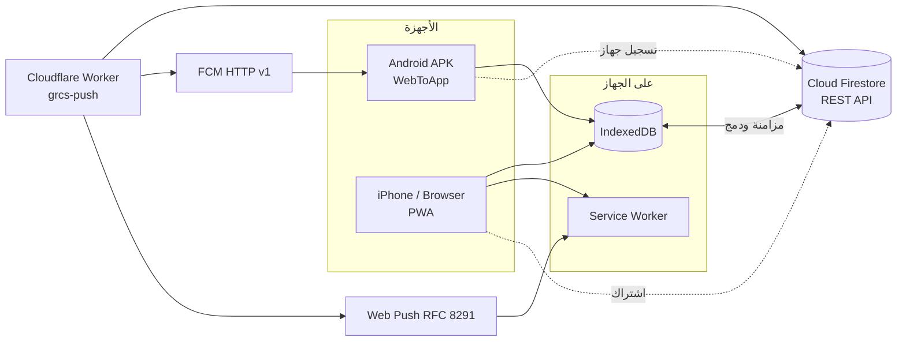

<div align="center">


# منظومة مخيمات النزوح
### Gaza Refugee Camps System — GRCS

**نظام متكامل لإدارة بيانات مخيمات النزوح — يعمل بدون إنترنت، ويتزامن لحظياً بين كل الأجهزة**

<p>


</p>
<p>


</p>

[**تجربة مباشرة**](https://dev-saged.github.io/wasla-system/) · [**الإصدارات**](https://github.com/Dev-saged/wasla-system/releases) · [**الإبلاغ عن مشكلة**](https://github.com/Dev-saged/wasla-system/issues)

</div>

---

<div dir="rtl">

## نبذة

**GRCS** منظومة لإدارة كشوف الأسر والأفراد في مخيمات النزوح بقطاع غزة. صُمّمت لبيئة ميدانية حقيقية: اتصال متقطع، هواتف متوسطة الإمكانيات، ومستخدمون بأدوار مختلفة يعملون على نفس البيانات في نفس الوقت.

ملف HTML واحد يعمل كتطبيق **Android** عبر WebToApp، وكتطبيق **PWA** قابل للتثبيت على iPhone وأي متصفح — بدون أي خطوة بناء.

<table>
<tr>
<td align="center" width="25%"><br><sub>يعمل كاملاً بلا إنترنت بعد أول دخول</sub></td>
<td align="center" width="25%"><br><sub>أي تعديل يظهر عند الجميع فوراً</sub></td>
<td align="center" width="25%"><br><sub>يفهم أي كشف Excel عربي تلقائياً</sub></td>
<td align="center" width="25%"><br><sub>Push لأندرويد و iPhone</sub></td>
</tr>
</table>

---

## الأدوار والصلاحيات

| الدور | ما يستطيع فعله |
|:--|:--|
| **المسؤول العام** | إدارة كل المخيمات والحسابات · رؤية كلمات مرور الحسابات · تقارير وتصدير شامل · إرسال إشعارات جماعية · سجل نشاط المناديب · حذف وإفراغ المخيمات |
| **مندوب المخيم** | إدارة أسر وأفراد مخيمه · استيراد وتصدير Excel · تعديل معلومات المخيم · الرد على طلبات المستفيدين · مراسلة الإدارة والمستفيدين |
| **مدخل البيانات** | إضافة وتعديل الأفراد واستيراد الكشوف لمخيمه |
| **المستفيد (رب الأسرة)** | ملف شخصي · إدارة أفراد أسرته · طلبات مساعدة · إشعارات · تواصل مباشر مع إدارة المخيم |

> حساب المستفيد يُنشأ تلقائياً عند استيراد الكشف: **اسم المستخدم = رقم الهوية**، وكلمة المرور الافتراضية قابلة للتغيير.

---

## المزايا

<details open>
<summary><b>إدارة البيانات</b></summary>

- لوحة إحصائيات لحظية: الأسر، الأفراد، الرضّع، الحوامل، المرضعات، الأمراض المزمنة، الإعاقات، الأرامل
- بحث وتصفية متقدمة حسب العمر والجنس والحالة الصحية والاجتماعية
- كشف التكرار الوطني: يمنع تسجيل نفس رقم الهوية في مخيمين
- سجل تعديلات كامل لكل فرد: من عدّل، ماذا، ومتى
- تنبيه عند تعديل نفس السجل من جهازين بنفس اللحظة

</details>

<details open>
<summary><b>الاستيراد والتصدير</b></summary>

- استيراد ذكي يتعرّف تلقائياً على ثلاثة أشكال للكشوف: أفقي (رب أسرة + زوجة + أبناء)، مختصر بالأعداد، وصف لكل فرد
- تطبيع عربي للعناوين والقيم، وحفظ أي عمود غير معروف كحقل إضافي بلا فقدان بيانات
- **توقيع GRCS:** الملف المُصدَّر يحمل نسخة كاملة مخفية من البيانات، فإعادة رفعه تسترجع كل حقل بدقة 100% بلا تكرار
- تصدير Excel منسّق بهوية المنظومة، و CSV، وطباعة، مع نسخة محلية من كل ملف

</details>

<details open>
<summary><b>صفحة المستفيد</b></summary>

- **ملفي:** الاسم والهوية مقفولان · تعديل الهاتف والعنوان والحالة الصحية والوضع المعيشي والاحتياج الطارئ
- **أسرتي:** إضافة مولود أو فرد · تحديث الحمل والرضاعة · بيانات صحية لكل فرد · حذف ابن بتأكيد مزدوج
- **طلباتي:** غذاء، دواء، ملابس، مأوى، مساعدة مالية — مع حالة الطلب ورد المندوب
- **إشعاراتي:** تفعيل الإشعارات، آخر الإشعارات، وسجل التعديلات على بيانات الأسرة

</details>

<details open>
<summary><b>الاعتمادية</b></summary>

- إعادة محاولة ذكية بتراجع أسّي لكل طلب شبكة
- فحص اتصال فعلي (لا يعتمد على مؤشر المتصفح وحده)
- مزامنة فورية عند العودة للتطبيق أو رجوع الإنترنت
- طابور مزامنة ذاتي التنظيف، وترقية قاعدة بيانات تراكمية آمنة
- تنظيف دوري تلقائي يُبقي التطبيق خفيفاً بعد أشهر من الاستخدام
- نسخ احتياطي واستعادة كاملة، وفحص تحديثات تلقائي

</details>

---

## البنية



<details>
<summary><b>كيف تعمل المزامنة</b></summary>

- **IndexedDB** هو مصدر الحقيقة على الجهاز، فالتطبيق يعمل ويحفظ بلا إنترنت
- بيانات كل مخيم تُحفظ سحابياً كمستند واحد مضغوط (gzip) لتقليل القراءات والكتابات
- الدمج يتم على مستوى الفرد: التعديل الأحدث يفوز، والحذف لا يلغي تعديلاً أحدث منه
- الإفراغ الكامل لمخيم علامة مركزية يلتقطها كل جهاز عند أول مزامنة
- المعلومات المشتركة (اسم المخيم، اسم وهاتف المستفيد) لها مصدر حقيقة واحد يُنشر لكل من يعتمد عليه

</details>

---

## التقنيات

| الطبقة | التقنية |
|:--|:--|
| الواجهة | HTML5 · CSS3 · Vanilla JavaScript (ES Modules) — ملف واحد بلا بناء |
| التخزين المحلي | IndexedDB (مخطط تصريحي v4) · localStorage |
| السحابة | Cloud Firestore عبر REST API مباشرة |
| الإشعارات | Cloudflare Workers · FCM HTTP v1 · Web Push (VAPID) |
| Excel | SheetJS للقراءة · ExcelJS للتصدير المنسّق (مخزّنة للعمل أوفلاين) |
| التوزيع | GitHub Pages (PWA) · WebToApp (Android APK) |

---

## هيكل المستودع

```text
wasla-system/
├──           التطبيق الكامل (Android + PWA)
├──         Service Worker — كاش أوفلاين واستقبال الإشعارات
├──      هوية تطبيق الويب القابل للتثبيت
├──   Cloudflare Worker لإرسال الإشعارات
├── icon-192.png             أيقونة التطبيق
├── icon-512.png             أيقونة التطبيق بدقة عالية
├── icon-maskable-512.png    أيقونة Android التكيفية
└── apple-touch-icon.png     أيقونة iPhone
```

---

## التشغيل والنشر

<details open>
<summary><b>1 — نسخة الويب (PWA)</b></summary>

1. ارفع كل ملفات المستودع إلى الفرع `main`
2. فعّل **GitHub Pages** من إعدادات المستودع على الفرع `main`
3. افتح الرابط من الهاتف:
   - **Android / Chrome:** سيظهر زر التثبيت تلقائياً
   - **iPhone / Safari:** زر المشاركة ← **إضافة إلى الشاشة الرئيسية**

</details>

<details>
<summary><b>2 — تطبيق Android</b></summary>

1. أنشئ مشروعاً جديداً في **WebToApp** من ملف `index.html`
2. اضبط `targetSdk` على 28 وفعّل تجاوز CORS
3. انشر ملف APK في [الإصدارات](https://github.com/Dev-saged/wasla-system/releases) — التطبيق يفحص الإصدارات الجديدة تلقائياً

</details>

<details>
<summary><b>3 — خادم الإشعارات</b></summary>

1. انشر `grcs-push-worker.js` على **Cloudflare Workers**
2. اضبط الأسرار التالية من لوحة Cloudflare (لا تضعها في الكود أبداً):

| السر | الغرض |
|:--|:--|
| `FIREBASE_SA` | حساب خدمة Firebase للوصول إلى Firestore و FCM |
| `VAPID_PRIVATE_JWK` | مفتاح توقيع Web Push |
| `PUSH_ADMIN_KEY` | حماية نقطة الإرسال |

</details>

---

## الأمان والخصوصية

- كلمات المرور تُشفَّر بـ **PBKDF2**، والجلسات لها مدة صلاحية مع خيار "تذكّرني"
- الأسرار تعيش في Cloudflare Secrets فقط، ولا يوجد أي مفتاح خاص داخل الكود
- كل نص يُعرض يمر عبر تهريب HTML لمنع حقن الشيفرات
- المستفيد لا يستطيع تعديل اسمه أو رقم هويته، ولا حذف الزوجة أو تغيير صلة القرابة
- حذف الحساب أو تعطيله من الإدارة يُخرج المستخدم من جهازه فوراً

---

## سجل الإصدارات

| الإصدار | أبرز ما فيه |
|:--|:--|
| **3.0.0** | صفحة مستفيد بأربعة تبويبات وطلبات مساعدة · توقيع التصدير وإعادة استيراد مطابقة · مزامنة ذكية وتنظيف دوري · أيقونة جديدة |
| **2.9.x** | مصدر حقيقة موحّد لاسم المخيم وبيانات المستفيد · إفراغ مركزي للمخيم · إعادة محاولة ذكية · ترقية قاعدة البيانات |
| **2.8.x** | إشعارات Web Push لـ iPhone · نسخة PWA على GitHub Pages |

---

<div align="center">

**تطوير:** المهندس ساجد العبادلة · [@Dev-saged](https://github.com/Dev-saged)
**إدارة المنطقة:** ايهاب العبادلة

<sub>جميع الحقوق محفوظة © 2026</sub>

</div>

</div>

